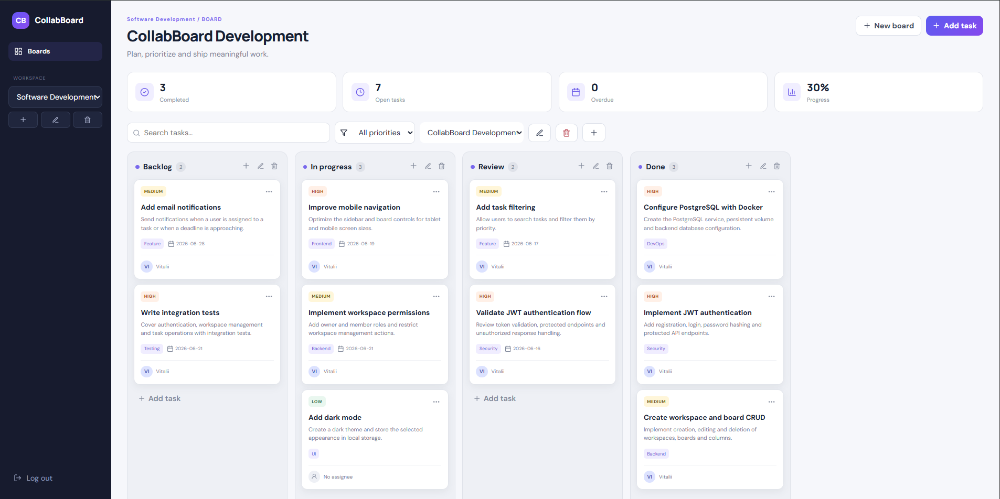
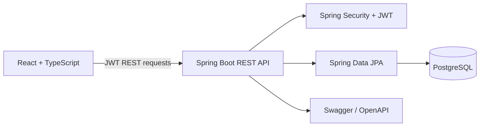

# CollabBoard


A full-stack Kanban project-management application built as a Computer Science portfolio project. It demonstrates secure authentication, protected relational data, CRUD workflows, task filtering, persisted drag-and-drop movement, API documentation, containerized setup and continuous integration.



## Features

- JWT registration and login with BCrypt password hashing
- User-owned workspaces and boards
- Automatic starter workspace and Kanban board for new users
- Create multiple boards and columns
- Create, edit, move and delete tasks
- Drag tasks between Kanban columns with persisted state
- Priority, assignee, label, description and due-date fields
- Search and priority filtering
- Completed, open, overdue and progress statistics
- Ownership checks for nested resources
- Centralized backend error handling and validation
- Swagger/OpenAPI documentation
- Responsive React interface with desktop, tablet and mobile navigation
- Docker Compose development environment
- GitHub Actions backend and frontend builds

## Technology

| Area | Stack |
|---|---|
| Backend | Java 21, Spring Boot 3.4, Spring Security, Spring Data JPA, Hibernate, Bean Validation |
| Authentication | JWT, BCrypt, stateless security filter chain |
| Frontend | React 18, TypeScript, Vite, Axios, Lucide React |
| Database | PostgreSQL 16 |
| API documentation | Springdoc OpenAPI / Swagger UI |
| Infrastructure | Docker, Docker Compose, GitHub Actions |

## Run locally

### Requirements

- Docker Desktop with Docker Compose

### Start

```bash
docker compose up --build
```

Open:

- Application: `http://localhost:5173`
- Backend API: `http://localhost:8080`
- Swagger UI: `http://localhost:8080/swagger-ui.html`

Register a new user. Example credentials:

```text
Email: demo@demo.com
Password: demo12345
```

To reset all local data:

```bash
docker compose down -v
```

## Architecture



The frontend sends a JWT in the `Authorization` header. Spring Security authenticates the request, while `AccessService` verifies that the current user owns the requested workspace, board, column or card before any mutation is allowed.

## Main API routes

| Method | Endpoint | Description |
|---|---|---|
| `POST` | `/api/auth/register` | Register and return an access token |
| `POST` | `/api/auth/login` | Authenticate and return an access token |
| `GET`, `POST` | `/api/workspaces` | List or create workspaces |
| `GET`, `POST` | `/api/boards` | List or create boards |
| `GET` | `/api/boards/{id}/snapshot` | Load columns and tasks for a board |
| `POST`, `PATCH`, `DELETE` | `/api/columns` | Manage Kanban columns |
| `POST`, `PATCH`, `DELETE` | `/api/cards` | Manage tasks |
| `PATCH` | `/api/cards/{id}/move` | Persist task movement |

## Repository structure

```text
collabboard/
├── backend/
│   └── src/main/java/com/example/collabboard/
│       ├── api/          REST controllers
│       ├── domain/       JPA entities
│       ├── repo/         Spring Data repositories
│       ├── security/     JWT and Spring Security
│       ├── service/      ownership checks
│       └── exception/    API error handling
├── frontend/
│   └── src/              React application
├── docs/screenshots/     Portfolio screenshots
├── .github/workflows/    Continuous integration
├── docker-compose.yml
├── .env.example
└── README.md
```

## Engineering decisions

**Stateless JWT authentication.** The frontend and backend remain independently deployable, and protected API requests do not depend on server-side sessions.

**Ownership validation in the backend.** UI restrictions are not treated as security. Every nested operation is verified against the authenticated user.

**Board snapshots.** A single endpoint returns columns and cards required to render a board, reducing unnecessary initial requests.

**Containerized development.** Docker Compose provides repeatable versions of Java, Node and PostgreSQL and avoids machine-specific database setup.

## Current limitations and roadmap

- Add workspace invitations and `OWNER`, `ADMIN`, `MEMBER` permissions
- Add comments and activity history
- Add task attachments with S3-compatible storage
- Add optional real-time collaboration after the core CRUD workflow is fully covered by tests
- Add Playwright end-to-end tests
- Deploy a public live demo

## What I learned

This project strengthened my understanding of Spring Security filter chains, JWT lifecycle, relational entity ownership, REST API design, React state management, responsive layout design, drag-and-drop persistence, Docker networking and CI workflows.

## Author

**Vitalii Dobrohorskyi**  
Computer Science student — Web Application Development

This is an educational portfolio project, not a commercial product.

## License

Released under the [MIT License](LICENSE).


## Quality checklist

- Idempotent first-run bootstrap prevents duplicate default workspaces in React development mode.
- Workspace, board, column and task CRUD are available from the UI.
- Destructive operations require confirmation and cascade through child data.
- Cross-board card moves are rejected by the API.
- Empty, loading and API error states are handled in the interface.
- Frontend production build is verified with `npm run build`.
